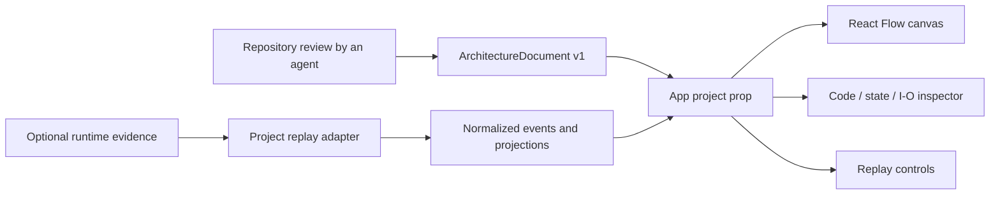

# Project contract and extension boundaries

The agent reads the target repository and authors an `ArchitectureProject`.
The canvas is independent of the repository, programming language, and agent.
`src/core/types.ts` is the versioned contract; `src/core/validate.ts` checks references
and consistency. `src/project.ts` selects the project and `src/main.tsx` mounts it.

## Dependency direction

Shared UI/core cannot import concrete projects or bundled JSON. `npm run check`
enforces that boundary, with `project.ts` and `main.tsx` as composition roots.
Keep raw log parsing, state reconstruction, classifications and source extraction
inside project adapters or their generation scripts.

## Describe a repository

1. Create an `ArchitectureDocument` with `schemaVersion: 1`, stable IDs, components,
   services, directed connections, source definitions, connection kinds, views,
   modes and defaults. Components represent responsibilities found in code.
2. Include source code, paths, symbols, languages and correct line ranges for
   indexed definitions. Source URLs are optional; external components can have no
   sources. Unsupported languages render as plaintext. Do not infer missing state
   from an empty schema list.
3. Connections can represent calls, dependencies or messages. Contract references
   and examples are optional. Put trigger, failure behavior, evidence and any
   uncertainty in the connection's description fields. IDs are local to each
   document namespace.
4. Pass `{document}` to App for a static canvas. If a useful flow exists, supply a
   ReplayAdapter with normalized runs/events, labels and defaults. Snapshot, metrics,
   recordedIO, import and serialize are optional. Omit unavailable capabilities.
5. `recordedIO` returns undefined when unsupported for that component, null before
   any relevant record, or a pair with provenance. All projections must be bounded
   by the cursor. Trace nodes/edges and decision actor IDs must resolve.
6. Select the adapter in `src/project.ts`. Increment document version when replacing
   its structure so selections and playback state reset. Add a browser walkthrough.

Runs require at least one event. A replay adapter without bundled runs currently
has no player entry point; import-only sessions are not supported. Payloads and
opaque adapter data must be JSON-serializable for display. The renderer does not
interpret raw log fields or execute the target application. Illustrative flows must
say they are illustrative in their title, badge, provenance and narrative.

The starter defaults to the TypeScript job queue (`src/projects/example/`).
`?project=static-example` omits replay; `?project=http-example` demonstrates a Go
handler, external caller, schema-less edge and illustrative event-only flow.
These examples prove capability variations, not prescribed architecture for new projects.

## Preserve the visual design

`notebook.css` supplies the existing light field-notebook presentation. Keep one
canvas, focused views, optional detail, collapsed browsing and one replay entry point.
The inspector progressively reveals source, fields, state and connections. ELK
computes grouped orthogonal routes; React Flow renders them with aligned ports.
Following replay reveals active nodes without discarding the selected focus.

Use metadata to customize content. Avoid replacing this presentation when applying
the skill to a new repository. The compiled HTML embeds its code and assets for
offline viewing. No CDN or server is required to view the artifact.

## Limits and design references

Project adapters are trusted TypeScript application code. Validation checks their
references, not arbitrary untrusted JSON shapes. Universal source extraction,
live instrumentation and Git change comparison are not implemented. The agent
performs repository analysis and documents coverage and unknowns.

This separation applies dependency inversion and interface segregation from
[Hello Interview design principles](https://www.hellointerview.com/learn/low-level-design/in-a-hurry/design-principles)
and [Adapter/Strategy](https://www.hellointerview.com/learn/low-level-design/in-a-hurry/patterns).

## Detail levels

Author one canonical graph with progressively disclosed structure. Missing `detail`
means Overview; use `detail: "implementation"` for supporting modules/stores and
`detail: "code"` for actual source-backed functions/classes. Give each detailed node
an owning `parent` at a strictly coarser level in the same service. Code nodes must
have source references. Prefer a small overview that explains the main flow; only
add levels justified by repository evidence. Do not invent internals to fill levels.

Connections can reference detailed endpoints: the renderer projects them to visible
owners when collapsed, omits collapsed internal edges, and preserves original IDs
for inspection and replay. Include descendants in applicable focus presets. Detail
is cumulative and independent of Focus; changing levels retains selection and
replay cursor. Legacy implementation nodes without parents remain supported but
cannot project onto an owner. New adapters should always supply owners.

Validate meaningful structure and source links at every supported level, and replay
the same flow through each. Clearly distinguish observed execution from synthetic
walkthroughs. The bundled webhook, LLM limiter and URL shortener are examples of
adapter authoring, not required architecture templates for other repositories.

## Step guide

`StepGuide` consumes the existing replay cursor, trace, connections and optional
snapshot adapter. Its numbered sequence and the timeline navigate the same events.
The panel shares the inspector slot: inspecting a flow or component opens the
inspector, and Back to step guide restores the guide at the same cursor. The guide
shows original traced endpoints even when the canvas aggregates them at a coarser
detail level. It never infers ordering among a step's edges or parses domain payloads.
While the guide is visible, RunPlayer retains transport and decision controls and
hides its duplicate narrative/journal. Closing the guide restores the full notebook.
